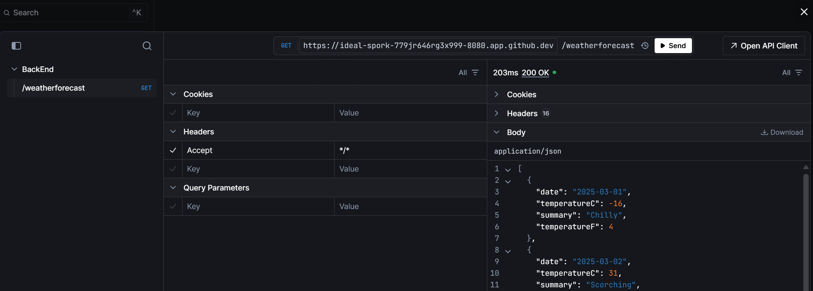

# GitHub ♥️ .NET

Want to try out the latest performance improvements coming with .NET for web development? 

This repo builds a Weather API, OpenAPI integration to test with [Scalar](https://learn.microsoft.com/aspnet/core/fundamentals/openapi/using-openapi-documents?view=aspnetcore-9.0#use-scalar-for-interactive-api-documentation), and displays the data in a web application using Blazor with .NET. 

We've given you both a frontend and backend to play around with and where you go from here is up to you!

## Prerequisites

Before getting started, make sure you have the following tools and versions installed:

- **.NET 9.0 SDK** - This application targets .NET 9.0
  - Download from: [https://dotnet.microsoft.com/download/dotnet/9.0](https://dotnet.microsoft.com/download/dotnet/9.0)
  - Verify installation: `dotnet --version` (should show 9.0.x or higher)

### Run Options
 
1. Clone the repo to your local machine `git clone https://github.com/es-copilot-trainings/dotnet-copilot`
2. Open repo in VS Code

## Getting started

1. **▶️ Run all, one-click**: Use VS Code's built-in *Run* command and open the forwarded ports *8080* and *8081* in your browser. 

3. The Blazor web app and Scalar can be open by heading to **/scalar** in your browser. On Scalar, head to the backend API and click "Test Request" to call and test the API. 

4. To stop running, return to VS Code, and click Stop twice in the debug toolbar. 

## Contributing

This project welcomes contributions and suggestions.  Most contributions require you to agree to a
Contributor License Agreement (CLA) declaring that you have the right to, and actually do, grant us
the rights to use your contribution. For details, visit https://cla.opensource.microsoft.com.

When you submit a pull request, a CLA bot will automatically determine whether you need to provide
a CLA and decorate the PR appropriately (e.g., status check, comment). Simply follow the instructions
provided by the bot. You will only need to do this once across all repos using our CLA.

This project has adopted the [Microsoft Open Source Code of Conduct](https://opensource.microsoft.com/codeofconduct/).
For more information see the [Code of Conduct FAQ](https://opensource.microsoft.com/codeofconduct/faq/) or
contact [opencode@microsoft.com](mailto:opencode@microsoft.com) with any additional questions or comments.

## Trademarks

This project may contain trademarks or logos for projects, products, or services. Authorized use of Microsoft 
trademarks or logos is subject to and must follow 
[Microsoft's Trademark & Brand Guidelines](https://www.microsoft.com/en-us/legal/intellectualproperty/trademarks/usage/general).
Use of Microsoft trademarks or logos in modified versions of this project must not cause confusion or imply Microsoft sponsorship.
Any use of third-party trademarks or logos are subject to those third-party's policies.
